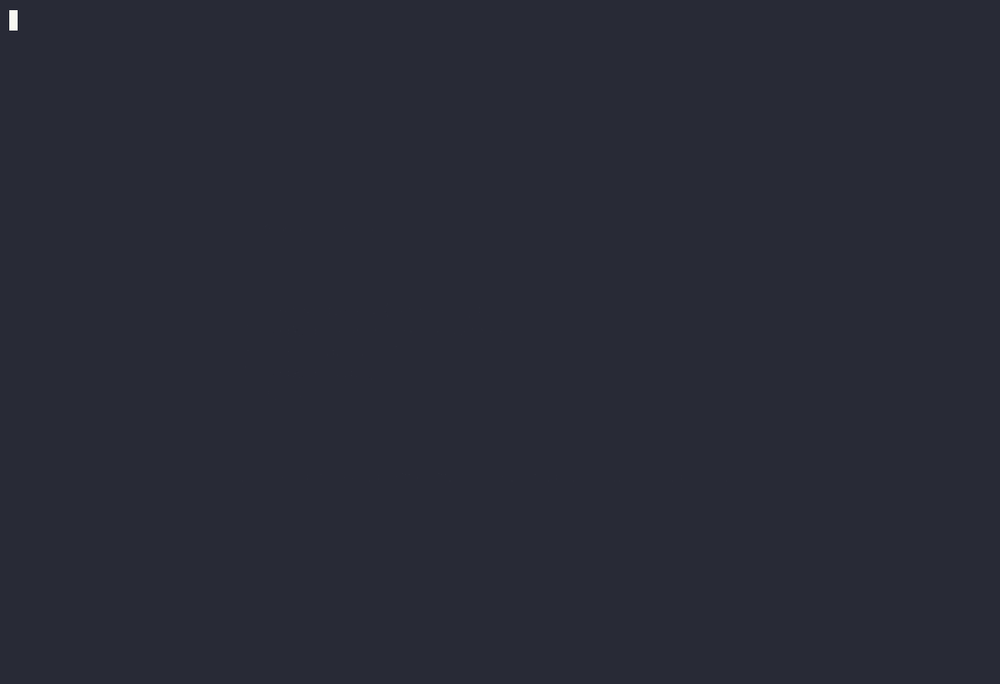

# workstation-doctor

`workstation-doctor` inspects developer tools on your computer and helps you maintain them safely through an interactive
terminal user interface (TUI).

The application inspects 18 components across coding agents, terminal tools, package managers, plugin registries, and
agent skills.



## Key Features

- **Single Terminal Dashboard**: All checks and maintenance actions run in one interactive terminal window.
- **Read-Only Inspection**: Health checks read files and call version commands without altering system state.
- **Safe Maintenance**: Maintenance commands run only when you give explicit approval.
- **Exclusive Process Lock**: An advisory lock prevents concurrent maintenance runs on the same workstation.
- **Audit History**: All maintenance attempts, step results, and verification outcomes are stored in a local SQLite
  database.

## System Requirements

- **Operating System**: macOS (Darwin arm64 or amd64) or Linux (amd64 or arm64).
- **Terminal**: An interactive terminal emulator that supports ANSI escape sequences (such as Ghostty, Alacritty,
  iTerm2, or Kitty).
- **Go**: Go 1.22 or newer (required only when you build from source or use `go install`).

## Installation

You can install `workstation-doctor` using any of the methods below.

### Method 1: Homebrew (macOS and Linux)

If you use Homebrew, install the formula directly from GitHub:

```sh
brew install devararishivian/tap/workstation-doctor
```

Or tap the repository first and install:

```sh
brew tap devararishivian/tap
brew install workstation-doctor
```

### Method 2: Go Install

If you have Go installed on your system, run:

```sh
go install github.com/devararishivian/workstation-doctor@latest
```

Make sure that your `PATH` environment variable includes `$GOPATH/bin` or `$HOME/go/bin`.

### Method 3: Download Pre-Built Binary

1. Open the [Releases page](https://github.com/devararishivian/workstation-doctor/releases).
2. Download the archive for your operating system and CPU architecture.
3. Extract the archive and move the binary to a directory in your `PATH`:

```sh
tar -xzf workstation-doctor_*_darwin_arm64.tar.gz
sudo mv workstation-doctor /usr/local/bin/
```

### Method 4: Build from Source

To compile the application from source code:

```sh
# Clone the repository
git clone https://github.com/devararishivian/workstation-doctor.git
cd workstation-doctor

# Build the binary
make build

# Move the executable to your PATH (optional)
sudo cp ./workstation-doctor /usr/local/bin/
```

## How to Use

To launch the dashboard, run:

```sh
workstation-doctor
```

The application opens an interactive dashboard. If you run the program in a non-interactive shell or pipe its output,
the program exits immediately with:

```text
An interactive terminal is required.
```

### Dashboard Navigation

- **Arrow keys (Up / Down)**: Select a component in the table.
- **Enter** or **d**: Open the detail view for the selected component.
- **1**: Re-run all health checks.
- **2**: Open the manual maintenance steps view.
- **3**: Run automatic maintenance for components that support it.
- **4**: Open the action history browser.
- **Esc** or **b**: Return to the previous screen.
- **q**: Exit the application.

### Command-Line Flags

You can customize program behavior with command-line flags:

- `--db PATH`: Set the absolute path for the action history SQLite database. Defaults to your operating system state
  directory.
- `--project PATH`: Set a project directory to inspect project-scoped tools and skills.
- `--location INTEGRATION=PATH`: Override the configuration path for an integration (repeatable).
- `--skill-root PATH`: Add an extra directory to scan for Agent Skills (repeatable).
- `--history-days N`: Set retention limit in days for history records (default: 90).
- `--history-limit N`: Set maximum number of history records to keep (default: 10000).
- `--version`: Print application version and exit.
- `--help`: Print flag help and exit.

## Inspected Components (18 Built-in Checks)

The application organizes checks into four categories:

### Developer Tools

1. **pi**: CLI binary discovery, npm provenance, and version checks.
2. **herdr**: Terminal runtime binary, GitHub release comparison, and provenance.
3. **ghostty**: Terminal application binary discovery and version checks.
4. **starship**: Shell prompt binary, release comparison, and provenance.
5. **opencode**: Global npm package inspection and version checks.
6. **tokenjuice**: Output compactor package inspection and version checks.
7. **serena**: Persistent tool receipts, PyPI metadata, and launcher declarations.
8. **gortex**: Code graph tool binary discovery and release comparison.

### Tool Configurations

9. **ghostty-config-valid**: Syntax validation of Ghostty configuration.
10. **herdr-config-valid**: Syntax and section validation of Herdr TOML configuration.
11. **pi-config-valid**: Syntax validation of Pi JSON settings and MCP declarations.

### Package Managers and Inventories

12. **brew-outdated**: Homebrew formula and cask update inspection (auto-update disabled).
13. **npm-outdated-g**: Global npm package receipt inspection and pin evaluation.
14. **pi-packages**: Declared npm, Git, and local extensions in user and project scope.

### Integrations and Resources

15. **superpowers**: Superpowers harness repository status, tracking branch, and commit sync.
16. **herdr-integr**: Verification of agent hooks and integration state.
17. **herdr-plugins**: Plugin declarations in user registry and remote commit sync.
18. **skills**: Agent Skills frontmatter (`SKILL.md`) validation, name matching, and bounds.

## Safe Maintenance Process

Maintenance operations follow a strict safety process:

1. **Inspection**: The application inspects current tool versions and reads available updates.
2. **Preview**: You see the exact commands, targets, and expected outcomes before execution.
3. **Confirmation**: You must press `y` to approve the action. If you press any other key, the application cancels the
   action.
4. **Advisory Lock**: The application acquires a kernel lock (`Flock`) so that two maintenance operations cannot run at
   the same time.
5. **Execution**: The application records the start of the action, then executes commands inside isolated process
   groups.
6. **Verification**: After commands complete, the application runs verification checks to make sure that the update
   succeeded.

## Limitations

- **Internet Access**: Checking for the latest tool versions requires an internet connection. If the network is
  unavailable, checks report unknown status and do not block the user interface.
- **Homebrew Auto-Update**: Homebrew checks run with `HOMEBREW_NO_AUTO_UPDATE=1` to prevent long pauses during audits.
  The check reports outdated packages based on your local Homebrew metadata.
- **Credentials**: The application never reads or displays private tokens or credentials from configuration files.

## AI Development Disclaimer

This project was built with the assistance of artificial intelligence (AI) coding agents working in pair-programming
workflows.

Every line of code, architecture decision, security boundary, and test case was reviewed, verified, and tested by human
engineers. All quality gates (`go vet`, unit tests with race detection, `golangci-lint`, and `govulncheck`) pass with
zero issues.

## License

This software is released under the **MIT Non-Commercial License (MIT-NC)**.

Copyright (c) 2026 Devvara Rishivian.

You may use, copy, modify, and distribute this software for non-commercial purposes. You must include the author's name
and copyright notice in all copies or substantial portions of the software. Commercial use is prohibited without prior
written permission from the copyright holder.

See the [LICENSE](LICENSE) file for complete terms.
